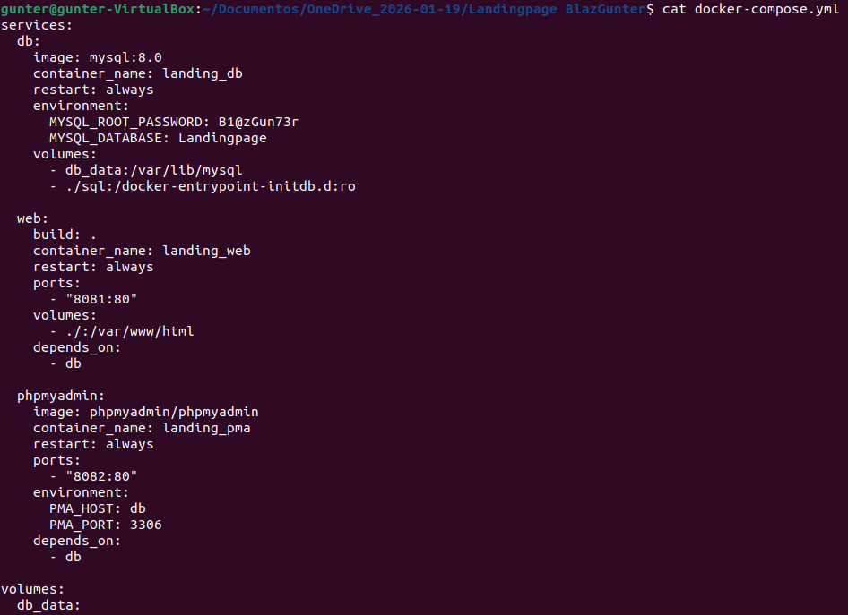

## M0375B4A6-dockerComposeFinal

Alumno: Gunter Blaz

Materia: Serveis de xarxa i Internet

## Introducción y objetivo

El objetivo de esta práctica final ha sido poner en marcha una página web creada anteriormente utilizando Docker Compose.
La web está hecha con HTML, CSS y PHP, y usa una base de datos MySQL para mostrar los productos.

La idea principal es que toda la página funcione dentro de contenedores, sin tener que instalar programas directamente en el sistema. De esta forma, el proyecto es más fácil de arrancar, mover a otro equipo y volver a usar en el futuro.

La idea principal es que toda la aplicación funcione dentro de contenedores, sin depender de programas instalados directamente en el sistema operativo, facilitando así su despliegue.

## Desarrollo de la actividad final

Durante las primeras actividades del módulo se trabajó con contenedores de forma individual para entender su funcionamiento básico. Una vez comprendidos estos conceptos, en la práctica final se aplicó todo junto usando Docker Compose.

Para esta actividad final, el proyecto de la landing page lo saque del anterior año en un proyecto de Lenguaje de marcas, organize dentro de una estructura clara para poder usarla desde los contenedores. A partir de ahí se definieron los servicios necesarios para que la aplicación funcionara correctamente.

Con Docker Compose se levantaron varios contenedores a la vez: uno para la web con PHP, otro para la base de datos MySQL y otro para phpMyAdmin. Todos ellos se comunican entre sí dentro de la misma red de Docker, lo que permite que la web acceda a la base de datos sin usar direcciones IP manuales.

Con un solo comando, todo el sistema queda en funcionamiento.

Página web funcionando desde el navegador usando Docker Compose

## Especificación de archivos principales

- **Dockerfile**: define cómo se construye la imagen del contenedor web con PHP, copiando los archivos necesarios para que la página funcione.  

- **docker-compose.yml**: es el archivo principal del proyecto. En él se definen todos los servicios, los puertos, los volúmenes y la red interna.  

## Incidencias encontradas y soluciones

Durante la práctica surgieron algunos problemas que al final corregi.

La web no mostraba los productos porque el archivo de conexión usaba localhost.
Lo solucione usando el nombre del contenedor de MySQL definido en docker-compose.yml.

Hubo un momento en el que ni página devolvía Forbidden porque Apache apuntaba a una carpeta incorrecta.
Se corrigió cambiando la ruta del volumen para que apuntara al directorio real del proyecto.

La base de datos estaba creada pero no tenía la tabla productos.
Se creó manualmente desde phpMyAdmin y la web empezó a funcionar correctamente.

## Preguntas 

¿Qué son los contenedores de Docker?

Los contenedores de Docker son como “cajas” donde se mete una aplicación junto con todo lo que necesita para funcionar. Dentro del contenedor está la web, el código y las librerías necesarias, pero sin instalar nada directamente en el sistema operativo. Esto hace que la aplicación funcione siempre igual, esté donde esté.

¿Qué diferencias hay entre los contenedores de Docker y los LXC?

Los LXC intentan parecerse a un sistema operativo completo, como una máquina virtual ligera. En cambio, Docker está pensado para ejecutar aplicaciones concretas, por ejemplo una web o una base de datos. Docker es más simple de usar, más rápido de mover entre equipos y está más enfocado a proyectos reales y despliegues rápidos.

¿Cuál es la diferencia entre una imagen y un contenedor en Docker?

Una imagen es como una plantilla o una receta. No hace nada por sí sola, solo define cómo debe ser el contenedor.
Un contenedor es esa imagen en funcionamiento. Es lo que realmente está encendido y ejecutando la aplicación.
Dicho de forma sencilla: la imagen es el plano y el contenedor es el edificio ya construido.

¿Qué sucede con los datos cuando un contenedor se elimina?

Si se elimina un contenedor sin ninguna configuración extra, todos los datos que hay dentro se pierden. Por eso es importante usar volúmenes, que permiten guardar los datos fuera del contenedor. Así, aunque el contenedor se borre o se reinicie, la información sigue estando disponible.

¿Cuáles son las ventajas de utilizar contenedores de Docker?

Una de las principales ventajas es que si algo funciona en un equipo, funcionará igual en otro.
También consumen menos recursos que las máquinas virtuales, son más rápidos de arrancar y permiten tener cada parte del proyecto separada, como la web y la base de datos, sin que se mezclen.

¿Qué tipo de aplicaciones y servicios se pueden desplegar con Docker?

Con Docker se pueden desplegar páginas web, bases de datos, aplicaciones móviles, servidores, herramientas de desarrollo y muchos otros servicios. Es muy flexible y se puede usar tanto para proyectos pequeños como para aplicaciones más grandes.

¿Qué otros tipos de contenedores existen además de Docker?

Además de Docker existen otras tecnologías como Podman, que es similar pero no necesita un servicio en segundo plano, y Kubernetes, que se usa para gestionar muchos contenedores a la vez. También existen LXC, que fueron una de las primeras opciones de contenedores.

Guía de usuario: pasos clave para desplegar una aplicación web con contenedores

Primero se prepara el proyecto con todos los archivos de la web bien organizados.
Después se crean los archivos necesarios para definir los contenedores, especialmente el docker-compose.yml, donde se indican los servicios que se van a usar.

Una vez todo está definido, se arranca el entorno con un solo comando y Docker se encarga de crear y conectar los contenedores automáticamente.
Por último, se comprueba que la web funciona correctamente y que los datos se guardan usando volúmenes para no perder la información.

## Conclusiones

- Docker Compose permite levantar una aplicación completa con un solo comando.  
- Separar la web y la base de datos en contenedores facilita el mantenimiento del proyecto.  
- El uso de volúmenes es clave para no perder información importante.  
- Este sistema hace que el proyecto sea fácil de mover y reutilizar en otros equipos o entornos.
